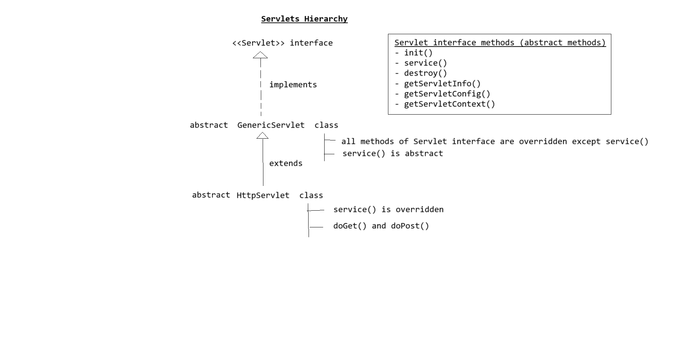

# Java EE Overview

Java EE (Java Enterprise Edition) is a set of specifications and APIs used to develop **web applications** and **enterprise applications**.

---

## 📦 Components of Java EE

### 1. Web Components
Used to develop **web applications**.

- **Servlets**
- **JSP (Java Server Pages)**

### 2. Enterprise Components
Used to develop **enterprise applications** (distributed, secured, and transactional).

- **EJB (Enterprise Java Beans)**

---

## 🌐 Java EE Application Deployment

Java EE applications are **accessed by multiple clients**. To make the application available, it must be **deployed on a server**.

---

## 🖥️ Types of Servers

### 1. Web Servers
Used **only** for web applications. Understands Servlets and JSP.

**Examples:**
- Apache Tomcat
- Adobe JRun
- Jetty

### 2. Application Servers
Used for both **web applications and enterprise applications**. Understands Servlets, JSP, and EJB.

**Examples:**
- Oracle WebLogic
- Oracle GlassFish
- IBM WebSphere
- RedHat JBoss

---

## 🔧 Technologies for Server-side Dynamic Web Applications

These technologies are commonly used to develop dynamic content on the server side:

- Servlets
- JSP
- Spring MVC
- ASP.NET
- PHP
- Django (Python)

---

## ☕ Servlets

Servlets are **Java programs** used to create **server-side dynamic web applications**.

---

## 📊 Servlet Architecture & Hierarchy

### Servlet Hierarchy



### Servlet Architecture


---

## 🔁 Servlet Life Cycle

The life cycle of a servlet is managed by the **Servlet Container** and involves the following methods:

| Method     | Description                                      |
|------------|--------------------------------------------------|
| `init()`   | Called once when the servlet is initialized. Usually used to set up resources like DB connections. |
| `service()`| Called for every client request. Handles request/response logic. |
| `destroy()`| Called once when the servlet is taken out of service. Used to clean up resources. |

---

## 🛠️ Creating a Servlet

### 1. Extending `GenericServlet` class

```java
import javax.servlet.*;
import java.io.*;

public class HelloServlet extends GenericServlet {
    public void service(ServletRequest request, ServletResponse response) throws ServletException, IOException {
        // Handle the request
    }
}
```

### 1. Extending `GenericServlet` class

```java	
2. By creating a class which extends HttpServlet class
    public class HelloServlet extends HttpServlet
    {
        public void doGet(HttpServletRequest request, HttpServletResponse response) throws ServletException, IOException
        {
	        //handle the request
        }
        public void doPost(HttpServletRequest request, HttpServletResponse response) throws ServletException, IOException
        {
	        //handle the request
        }
    }
```

Note
----
interface HttpServletRequest extends ServletRequest {}
interface HttpServletResponse extends ServletResponse {}

Note
----
class to class => extends
class to interface => implements
interface to interface => extends
interface to class => error
